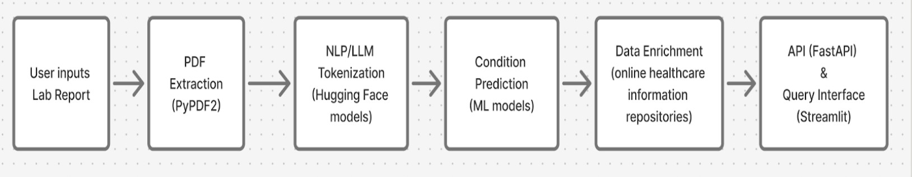

# MedReport Analyzer Application

MedReport Analyzer is an application that implements Natural Language Processing (NLP) techniques aiming to assist clinicians, researchers, and data scientists. It streamlines the process of summarizing various medical reports (like lab results, pathology reports, and radiology reports) and provides predicted medical conditions based on the content. A key feature is that the analysis is grounded in the report's text to minimize the risk of hallucination. The application also includes a conversational chat feature, allowing users to ask questions about the report, the generated summary, or any follow-up inquiries.

This directory contains the user interface, frontend logic, and the generic LLM calls for the application, built using Streamlit.

## How to Run

1.  **Prerequisites:** Ensure you have Python installed.
2.  **Clone the Repository:** Clone this repository to your account
3.  **Install Dependencies:** Set up a virtual environment (recommended) and install the required packages:
    ```bash
    python -m venv venv
    source venv/bin/activate # On Windows use `venv\Scripts\activate`
    pip install -r requirements.txt
    ```
4.  **API Keys:** Edit the `.env` file in the `streamlit_app_analyzer` directory and add your necessary API keys (e.g., for OpenAI if you plan to use it):
    ```
    OPENAI_API_KEY="your_openai_api_key_here"
    DEEPINFRA_API_KEY="your_key_here"    
    ```
5.  **Run the Application:**
    ```bash
    streamlit run streamlit_app.py
    ```

## Purpose and Features

The application allows users to:

*   **Upload Medical Reports:** Primarily handles PDF files, extracting the text content.
*   **View Extracted Text:** Displays the raw text extracted from the uploaded report for verification.
*   **Generate Summaries & Predictions:** Utilizes LLMs to create concise summaries and identify potential medical conditions mentioned in the report. Analysis is grounded in the source text.
*   **Conversational Chat:** Enables users to interact with an AI assistant to ask questions specifically about the loaded report and the analysis content.

## Key Files

*   `streamlit_app.py`: The main entry point for the Streamlit application. Sets up the basic page structure and navigation.
*   `app_components.py`: Contains the core UI components and logic for file uploads, results display, chat interactions, and analysis calls. **This is the primary file for integrating different LLM backends.**
*   `pdf_extraction.py`: Utility functions for extracting text from PDF files using `pdfplumber`.
*   `app_state.py`: Manages the session state for the Streamlit application (e.g., storing report text, chat history).
*   `requirements.txt`: Lists the necessary Python packages.
*   `.env`: Stores API keys and other environment variables.
*   `Dataset/`: Can be used for sample data or testing purposes.

## Approach

    ```markdown
    
    ```

## LLM Integration

This application is designed to work with various Large Language Models (LLMs). The code in this directory is pre-configured to use:

*   **General Purpose Models:**
    *   OpenAI models (e.g., GPT-3.5, GPT-4) via API.
    *   Models available through Ollama (e.g., Mixtral, Llama 2) running locally.
    *   Configuration for these models (like selecting which one to use and providing API keys in `.env`) is handled within `app_components.py` (specifically the `load_llm_model` function and its usage).

*   **Fine-Tuned Medical LLM:**
    *   To use a specialized, fine-tuned MedLlama2 model adapted for medical report analysis, you need to use the code provided separately in the **`MedReportAnalytics-main-LOCAL-LLM.zip`** archive (found in the parent directory or provided alongside this project).
    *   That archive contains a version of the application specifically set up to run and interact with the fine-tuned model as a local backend service. It includes the necessary API call integrations and prompts in its version of `app_components.py` and instructions for running the fine-tuned model server itself.

**In summary:** Use the code in *this* directory if you want to connect to OpenAI or a local Ollama instance. Use the code in the **`MedReportAnalytics-main-LOCAL-LLM.zip`** archive if you want to run the fine-tuned MedLlama2 model backend.


